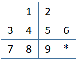

# Stage Puzzle Manhattan
<p align='center'>
  
</p>
With using packages from the textbook, this program solves a StagePuzzle with misplaced tile, manhattan distance, and the max of two heuristics. 
The stage puzzle is randomized in each run and the three heuristic methods to solve the problem is timed separately.

## Installation
1. Clone the repository
```bash
git clone https://github.com/Tooo/Stage-Puzzle-Manhattan.git
```
2. Download 
[search.py](https://github.com/aimacode/aima-python/blob/master/search.py)
and 
[utils.py](https://github.com/aimacode/aima-python/blob/master/utils.py) 
from Artificial Intelligence: A Modern Approach and insert them into the folder </br>
[Aimacode/aima-python](https://github.com/aimacode/aima-python)

3. Run the program with Python 3
```bash
python main.py
```

## StagePuzzle
StagePuzzle is a modified EightPuzzle with a similiar goal.
From a randomized StagePuzzle, the program must solved the puzzle using heuristics.
Below is an randomized example of a StagePuzzle.
```
  5 1
9 6 2 4
8 * 7 3
```
In each step, you can move neighbouring tiles into the blank tile.
The program must solve the puzzle by getting to the Final State (below).
```
  1 2
3 4 5 6
7 8 9 *
```
## Heuristics
### Misplaced Tile Heuristic
In misplaced tile heuristic, it is assumed that any tile can move into any position.
The heuristic will try to move each tile into the final positions.
Therefore, h(n) is the number of misplaced tiles.

### Manhattan Distance Heuristic
In manhattan distance heuristic, it is assumed tiles can be overlap.
Each tile must be move into the final position independently.
Therefore, h(n) is sum of vertical and horizontal displacement for each tile.

### Max of Two Heuristic
Both misplaced tile and manhattan distance is calculated and the max of the two are used.

## Sample Runs
### Run 1
```
  7 2
0 3 9 4 
8 1 5 6
```
|  | Total running time | Solution length | Removed frontier nodes|
|------------------------- | :----------------: | :-------------: | :-------------------: |
| Misplaced tile heuristic | 277.4s | 14,775 | 34,347 |
| Manhattan distance herusitic | 10.2s | 3,079 | 6,246 |
| Max of two heuristics | 10.3s | 3,079 | 6,246 |


### Run 2
```
  1 0
7 8 5 4 
9 2 6 3
```
|  | Total running time | Solution length | Removed frontier nodes|
|------------------------- | :----------------: | :-------------: | :-------------------: |
| Misplaced tile heuristic | 149.4s | 10,116 | 22,435 |
| Manhattan distance herusitic | 5.4s | 4,158 | 2,132 |
| Max of two heuristics | 6.0s | 4,158 | 2,132 |

## References
[Artificial Intelligence: A Modern Approach](http://aima.cs.berkeley.edu/)

[Artificial Intelligence: Foundations of Computational Agents, 2nd Edition](http://artint.info/2e/html/ArtInt2e.html)
